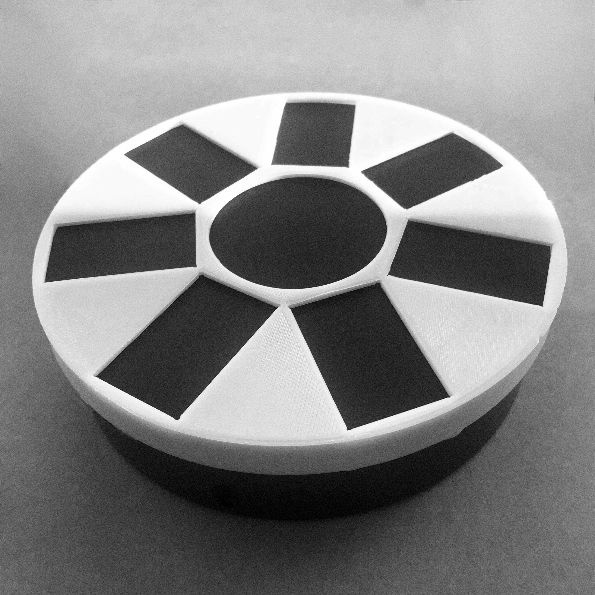
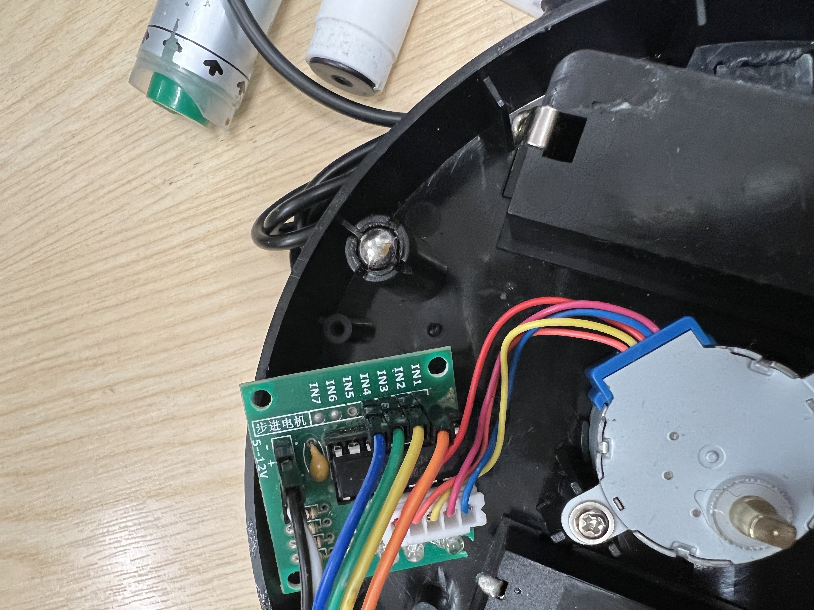
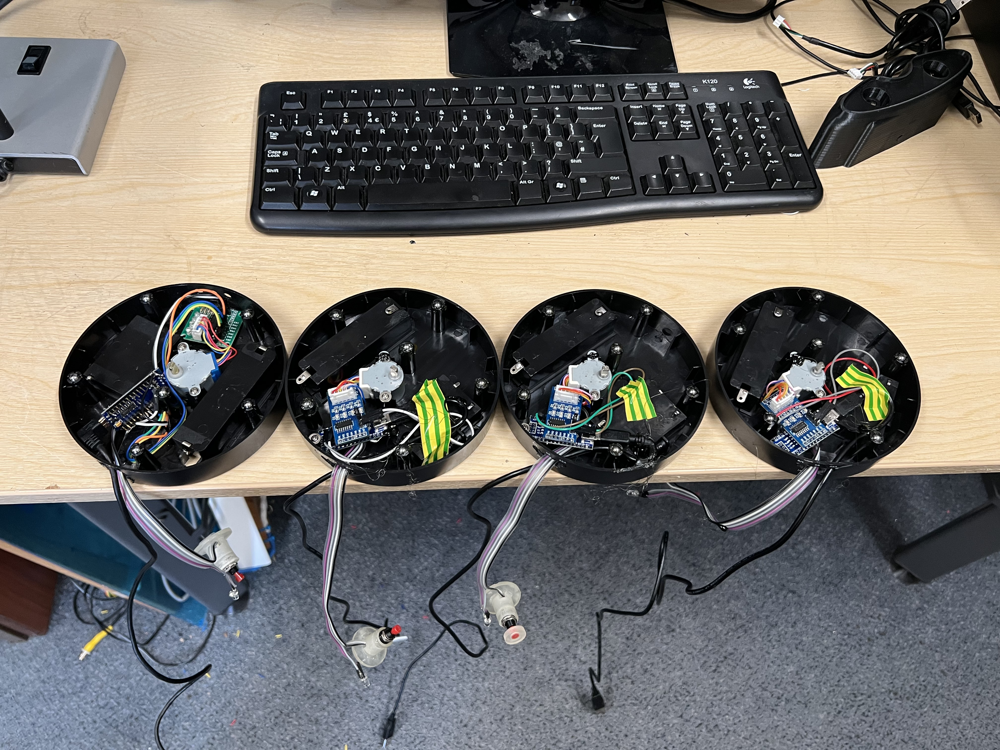
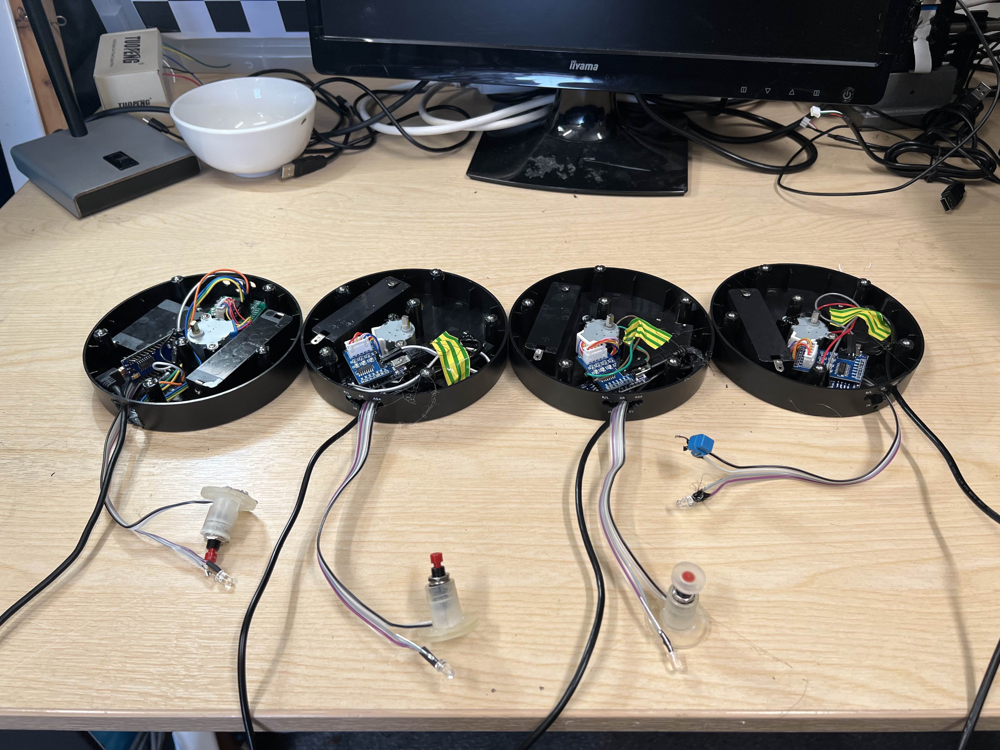
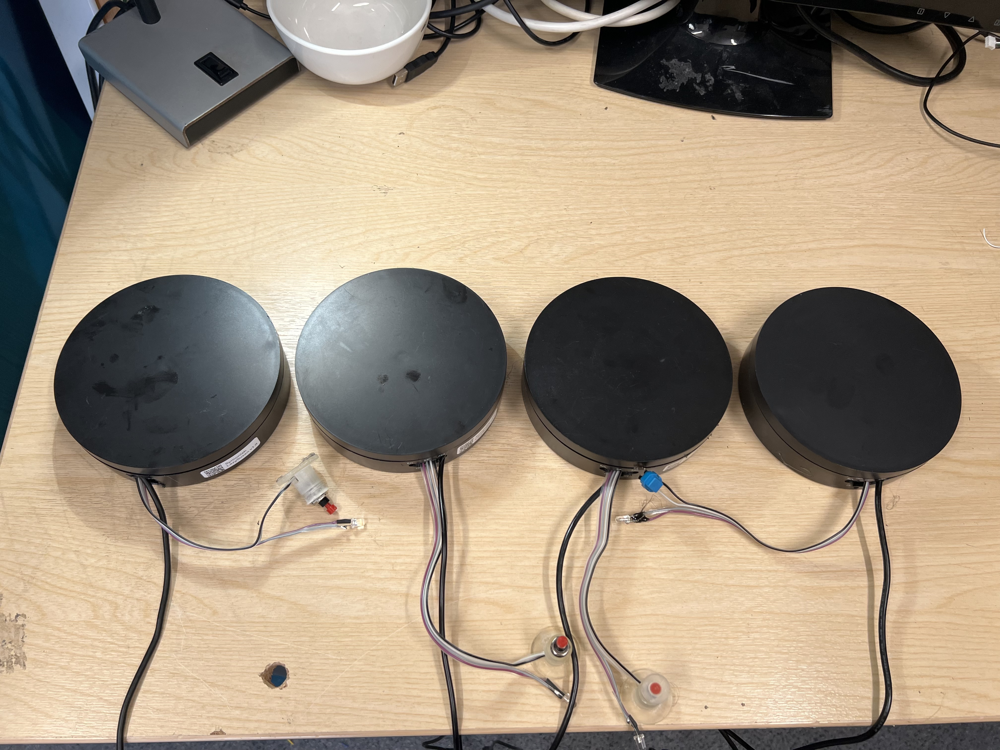

# Arduino-based Lazy Susan

Arduino code to control a Lazy Susan for a tactile experiment
  
 Roughness judgments are acquired through direct contact with a surface and exploration. 
 Due to social distancing requirements, in person experiments to study roughness perception are not possible.
 
 Here we devised a setup that can be mailed to participant’s homes with instructions on how to run the experiment and collect the data. 
 
 The device is built by combining an inexpensive lazy Susan with a microcontroller (Atmega168). Precisely manufactured 3D printed surfaces are mounted on the motorized lazy Susan and the microcontroller allows rapid selection of the appropriate sample. The code to control the experiment is included in this repository.
 
 
 
 
 
  

  
     
    
    
 
   
  
 <video controls="controls" width="420" height="315" name="Video Name">
  <source src="./IMG_0762.MOV">
</video>
 
 
   
  <object data="http://www.youtube.com/embed/Hrc2zLRdNaU"
  width="420" height="315"></object>
 

This project has been developed by <a href="https://massimilianodiluca.info/">Max Di Luca</a>.

